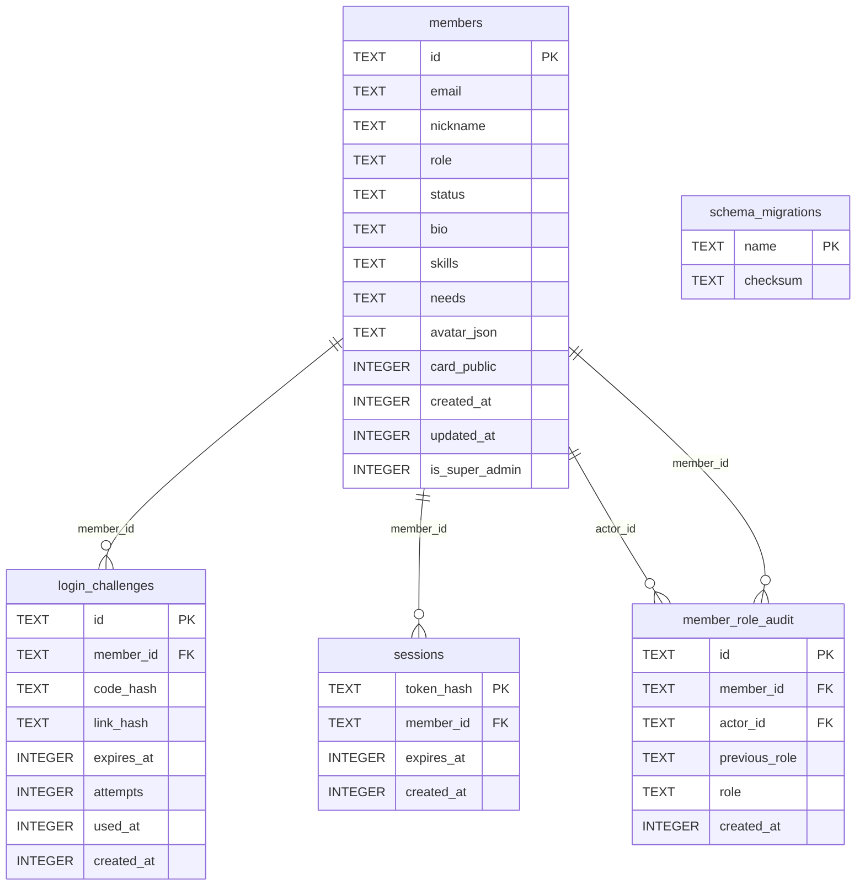
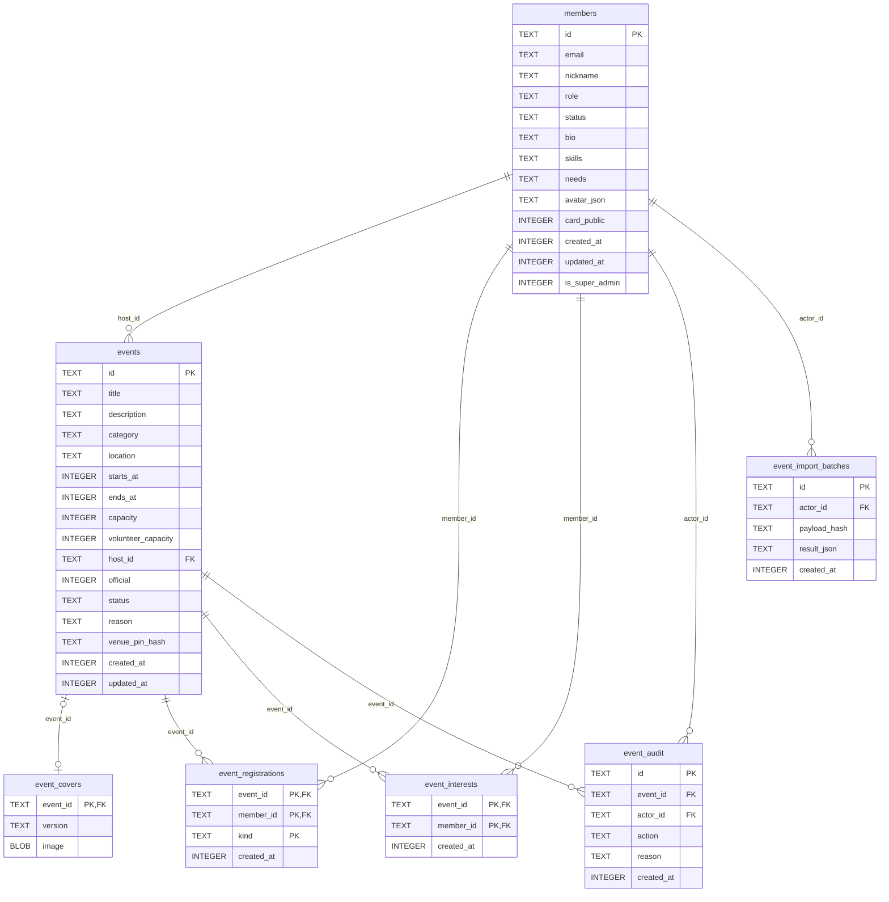
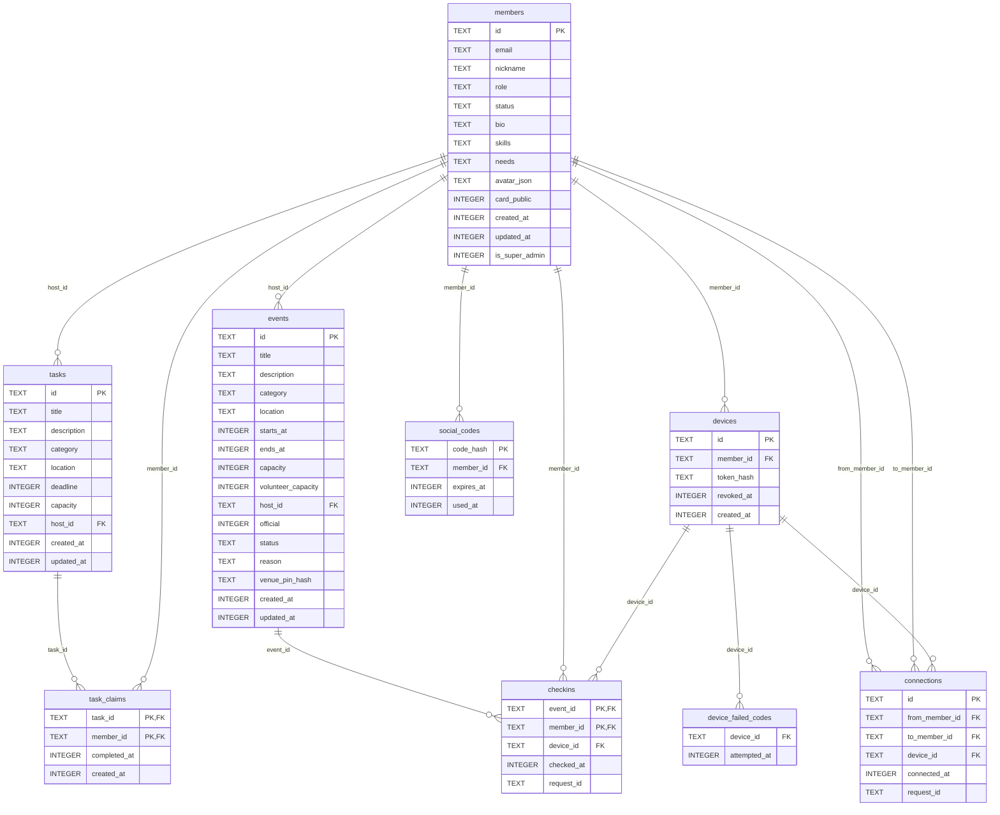
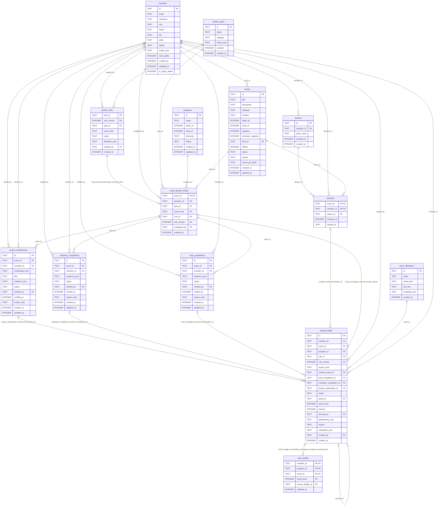

# 当前数据库表结构图

- **版本：** v1.0
- **负责人：** 技术实施
- **状态：** 按本机已应用 0001–0005 迁移的 SQLite 实际结构生成；未核对腾讯云实例
- **最后更新：** 2026-10-01

共 **28 张表（含 schema_migrations）和 1 个汇总视图**。只读取结构，未包含成员资料、令牌或业务记录。

**信心：★★★★★。** 字段、主键、外键直接读取本机 SQLite PRAGMA；成长系统已建表，但尚未提供核验和自动奖励业务入口。

> **2026-10-06 增量：** 以下图为原 0001–0005 的 28 表历史快照；0006–0009 后为 39 表与 1 个视图；0010 后为 45 表与 1 个视图；0011 后为48表与1个视图，增加game_jam_apps、game_jam_projects和game_jam_reviews，详见[Game Jam接入](game_jam_integration_v1.0.md)。0006 增加 member_planets；0007 增加 members.profile_completed_at；0008 只锁头像并释放普通资料编辑；0009 增加 10 张硬件表，精确字段与约束见 [迁移](migrations/0009_hardware_planet.sql) 与 [硬件数据契约](hardware_api_v1.0.md)。0010 增加固定发布、里程碑、角色审核、事实纠正、个人资产发放与冲正，见 [成长说明](planet_growth_v1.0.md)。本次验证本地数据库，未核对生产实例。

## 阅读说明

- PK：主键；FK：外键。同表多个 PK 字段构成联合主键。
- 图中列出全部字段；关联线以实际外键为准。图只概括基数，精确的复合外键见文末。
- INTEGER 时间字段使用 Unix 秒；avatar_json、definition_json 等字段以 TEXT 保存 JSON。
- events.id 对外可称 session_id；sessions 表专指登录会话。
- event_import_batches 的 result_json 保存导入结果，其中活动 ID 不是独立外键。
- user_assets 通过复合外键关联 reward_ledger，再间接关联成员、期数和资产目录。

## 成员与登录

`members`：成员资料；`login_challenges`：邮箱登录验证；`sessions`：登录会话；`member_role_audit`：权限变更审计；`schema_migrations`：迁移校验记录。



## 活动运营

`members`：成员资料；`events`：活动；`event_covers`：封面图片；`event_registrations`：参与或志愿报名；`event_interests`：个人收藏；`event_audit`：活动操作审计；`event_import_batches`：批量添加防重记录。



## 生活任务、设备与社交

`members`：成员资料；`events`：活动；`tasks`：生活任务；`task_claims`：领取与完成；`devices`：设备绑定；`checkins`：活动签到；`social_codes`：临时社交码；`connections`：名片交换关系；`device_failed_codes`：设备口令失败记录。



## 成长系统（存储已建，业务入口待开发）

`members`：成员资料；`events`：活动；`devices`：设备绑定；`checkins`：活动签到；`programs`：期数；`activity_types`：活动类型；`growth_rules`：版本化成长规则；`event_growth_config`：活动成长映射；`host_completions`：发起完成核验；`volunteer_completions`：志愿履约核验；`project_submissions`：长期项目贡献；`asset_definitions`：资产目录；`reward_ledger`：追加式奖励账本；`user_assets`：用户有效资产。



## 外键精确映射

| 子表 | 子字段 | 引用表 | 引用字段 |
|---|---|---|---|
| checkins | device_id | devices | id |
| checkins | member_id | members | id |
| checkins | event_id | events | id |
| connections | device_id | devices | id |
| connections | to_member_id | members | id |
| connections | from_member_id | members | id |
| device_failed_codes | device_id | devices | id |
| devices | member_id | members | id |
| event_audit | actor_id | members | id |
| event_audit | event_id | events | id |
| event_covers | event_id | events | id |
| event_growth_config | rule_id, rule_version, type_id, event_kind | growth_rules | rule_id, rule_version, type_id, event_kind |
| event_growth_config | configured_by | members | id |
| event_growth_config | type_id | activity_types | id |
| event_growth_config | program_id | programs | id |
| event_growth_config | event_id | events | id |
| event_import_batches | actor_id | members | id |
| event_interests | member_id | members | id |
| event_interests | event_id | events | id |
| event_registrations | member_id | members | id |
| event_registrations | event_id | events | id |
| events | host_id | members | id |
| growth_rules | created_by | members | id |
| growth_rules | type_id | activity_types | id |
| host_completions | verified_by | members | id |
| host_completions | member_id | members | id |
| host_completions | event_id | event_growth_config | event_id |
| login_challenges | member_id | members | id |
| member_role_audit | actor_id | members | id |
| member_role_audit | member_id | members | id |
| project_submissions | verified_by | members | id |
| project_submissions | member_id | members | id |
| project_submissions | event_id | event_growth_config | event_id |
| reward_ledger | project_submission_id, event_id, member_id | project_submissions | id, event_id, member_id |
| reward_ledger | volunteer_completion_id, event_id, member_id | volunteer_completions | id, event_id, member_id |
| reward_ledger | host_completion_id, event_id, member_id | host_completions | id, event_id, member_id |
| reward_ledger | checkin_event_id, member_id | checkins | event_id, member_id |
| reward_ledger | event_id, program_id, rule_id, rule_version | event_growth_config | event_id, program_id, rule_id, rule_version |
| reward_ledger | created_by | members | id |
| reward_ledger | reversal_of | reward_ledger | id |
| reward_ledger | asset_id | asset_definitions | id |
| reward_ledger | member_id | members | id |
| sessions | member_id | members | id |
| social_codes | member_id | members | id |
| task_claims | member_id | members | id |
| task_claims | task_id | tasks | id |
| tasks | host_id | members | id |
| user_assets | source_ledger_id, member_id, program_id, asset_id, asset_level | reward_ledger | id, member_id, program_id, asset_id, asset_level |
| volunteer_completions | verified_by | members | id |
| volunteer_completions | member_id | members | id |
| volunteer_completions | event_id | event_growth_config | event_id |

## 汇总视图与重要约束

```sql
CREATE VIEW member_growth_totals AS
  SELECT member_id,program_id,metric,SUM(amount) total FROM reward_ledger WHERE metric IS NOT NULL GROUP BY member_id,program_id,metric;
```

- 签到以 `(event_id, member_id)` 为联合主键；同人同场最多一条。
- 报名以 `(event_id, member_id, kind)` 为联合主键；参与者和志愿者身份可各有一条。
- 收藏以 `(event_id, member_id)` 为联合主键；取消收藏删除记录。
- 成长规则按 `(rule_id, rule_version)` 唯一，已写入版本不可修改或删除。
- 奖励每条只关联签到／发起／志愿／项目四类来源中的一类；来源可选基数不表示四种来源都可为空。
- 发起／志愿／项目须通过核验才可发奖；规则和账本由触发器约束，当前尚未接入自动结算。
- 奖励账本只追加；撤销以精确负数冲正记录实现。用户资产由账本触发器维护。
- 完整 CHECK、索引和触发器以 migrations/0001–0005 的 SQL 为准。
