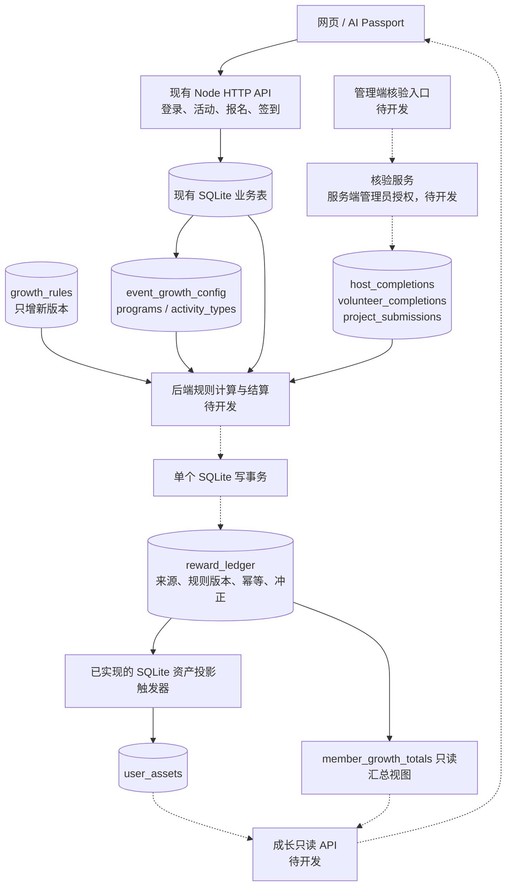
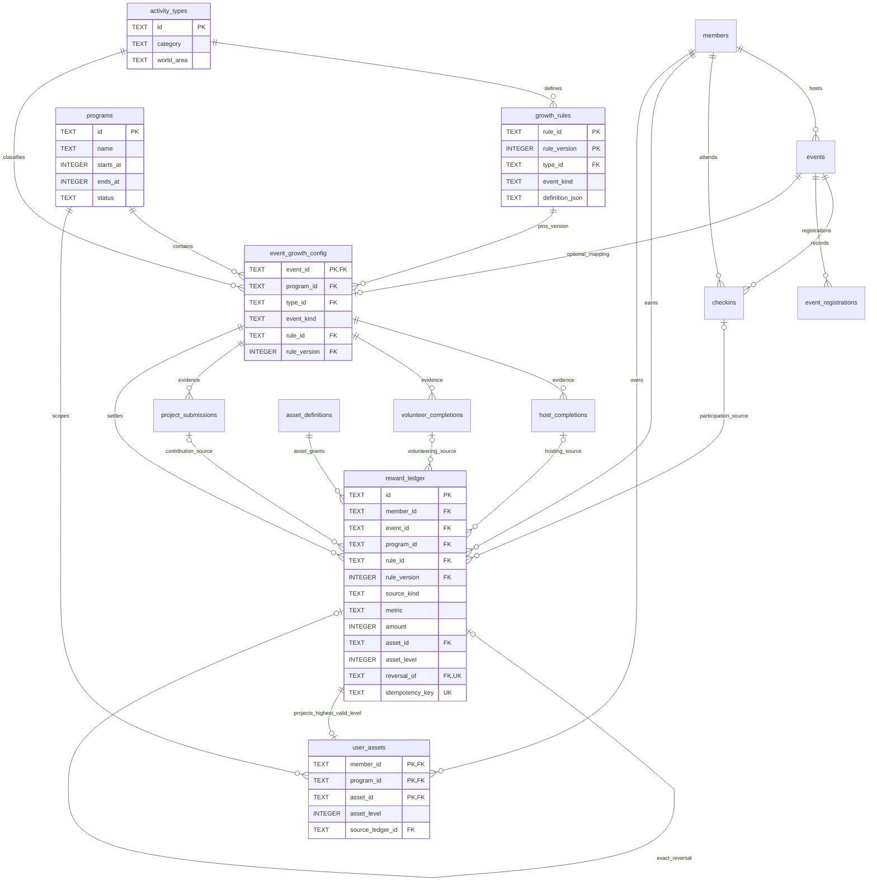

# 成长系统后端架构与对接契约

- **版本：** v1.0
- **负责人：** 技术实施；奖励规则负责人：产品侧
- **状态：** 数据结构及数据库约束已实现；成长 HTTP API、规则计算器和成长界面未实现
- **最后更新：** 2026-10-01

## 1. 本轮边界

新增 `migrations/0004_growth_system.sql`。`0001`、`0002`、`0003` 不改动，现有成员、活动、报名、签到接口及迟到限制不改动。成长系统通过外键读取已有事实；没有给旧活动自动设置期数、类型或规则，没有给历史签到自动发奖。

**ID 约定：** 对接方 `user_id = members.id`，`session_id = events.id`。内部 SQL 继续叫 `member_id / event_id`。现有 `sessions` 表是登录会话，与活动 session 完全不同，不能拿来关联成长数据。

**信心：★★★★★。** 新库、旧库升级、事务回滚和规则历史保护均有测试。完整 ACT 类型表、H/V/M 数值、资产等级阈值、开闭营规则尚未提供；本轮不以示例代替正式规则。

## 2. 后端架构图



实线表示数据关系或已实现存储能力；标注“待开发”的模块不代表已部署服务。继续使用单体 Node + SQLite；不引入新的云服务、队列或独立成长数据库。前端只能提交事实或核验请求、读取结果，不能上传 P/H/V/M 余额或指定奖励资产。

## 3. 表关系图



每条账本记录恰好使用一种来源：签到、发起完成、志愿履约或项目贡献。图中四种来源连接表示互斥选择，不能理解为每条奖励同时需要四种事实。完整字段、默认值、外键见 [数据字典](growth_data_dictionary_v1.0.md)。

## 4. 新增对象

| 对象 | 作用 | 关键规则 |
| --- | --- | --- |
| `programs` | 第几期 Herstory | `id` 稳定，记录起止时间和期数状态 |
| `activity_types` | ACT 类型目录 | `category/world_area` 由类型读取，不复制到活动 |
| `growth_rules` | 冻结的规则版本 | `(rule_id,rule_version)` 复合主键，禁止更新及删除 |
| `event_growth_config` | 活动到期数、类型、规则的映射 | 一场活动一个映射；已结算映射受账本外键保护 |
| `host_completions` | 发起完成核验 | 每活动／成员唯一；通过时必须是实际发起人 |
| `volunteer_completions` | 志愿履约核验 | 每活动／成员唯一；通过时必须有志愿者报名 |
| `project_submissions` | 长期项目贡献 | 每活动／成员／贡献键唯一；通过时必须映射长期项目 |
| `asset_definitions` | 稳定资产目录 | 资产 ID、展示名、类型、槽位和元数据；不预置正式资产 |
| `reward_ledger` | 追加式 P/H/V/M 和资产发放账本 | 冻结规则版本、强关联事实、业务去重和冲正 |
| `user_assets` | 每期每人的最终资产等级 | 由账本触发器同步维护，不能由前端写入 |
| `member_growth_totals` | 积分余额视图（不是表） | 按成员／期数／指标汇总，包含负数冲正 |

`events.category` 保留现有自由文本用途，不能拿它计算成长奖励。一个人的资产按期数隔离；如果将来要求跨期累积，需另立明确政策，不能直接去掉 `program_id`。

## 5. 核验和结算边界

### 核验

- `pending` 不带核验人或时间；其他状态必须带核验人和时间。
- 核验人必须是 active 管理员，且不能核验自己。管理员发起的活动须由另一管理员核验。
- `verified` 后不得换成员、活动或证据；`revoked` 不可重新变回有效。已核验事实不得删除。
- 撤销核验前，先在同一事务中冲正其未冲正奖励，再把事实设为 `revoked`。多条奖励全部冲正后才能撤销事实。
- 长期贡献的 `contribution_key` 应由后端按已批准的交付件或里程碑生成。任意更换贡献键不代表可以重复领奖。

### 结算

数据库已实现的底线：来源事实必须存在且与活动、成员对应；H/V/项目来源必须 verified；正向奖励接受人必须 active，活动必须 published；签到时间须符合目前的开始前一小时至开始前窗口。签到来源的 P 正向增量固定为 1，冲正为 -1。

规则计算器还须负责：核实活动确已完成、期数及类型启用条件、规则 JSON 的正式 schema 和适用范围、跨活动阈值、一次完整业务事实要产生哪些账本行。数据库约束不能证明现实中的服务履约，也不会解释任意 JSON 规则。仅有 `host_id`、volunteer 报名或感兴趣记录不构成领奖资格。

**建议的后端事务（尚未实现为 API）：**

1. 以真实会话鉴权，确定 actor 和目标事实，不能信任前端传来的管理员 ID。
2. `BEGIN IMMEDIATE`；重新读取事实、成员状态、活动、映射和冻结规则。
3. 校验请求幂等键。已存在时核对语义及输入摘要，返回原结果；不能对不同请求复用同一 key。
4. 由后端计算指标与资产；把计算输入摘要写入 `calculation_json`，不要写邮箱、令牌或敏感证据全文。
5. 写入该事实的全部 `reward_ledger` 行；SQL 触发器在同一事务更新 `user_assets`。
6. 提交事务。超时或响应丢失时按 key 查询原结果；禁止换 key 强行重复发奖。

同事实／同指标的业务唯一键不含规则版本，因此换版本、换请求 key 都不能再领取同一项奖励。项目按每份已核验贡献去重；其他来源按活动／成员／来源类型去重。规则升级必须新建版本；已有结算的活动不通过更新映射追溯改历史。

指标是带正负号的整数行；资产行 `metric=NULL`、`asset_id/asset_level` 非空，正向 `amount=1`。一条错误记录只能被等额、同人、同活动、同来源、同版本的反向行冲正一次。资产冲正会自动回到剩余有效发放的最高等级；没有剩余发放时移除投影行，账本仍保留。

## 6. 对接接口提案（未实现，不能直接调用）

| 建议接口 | 权限 | 输入／输出要点 |
| --- | --- | --- |
| `GET /api/growth/programs` | 成员 | 可用期数 |
| `GET /api/growth/activity-types` | 成员 | 类型、分类、区域；非奖励计算入口 |
| `PUT /api/admin/events/:id/growth-config` | 超级管理员 | 已存在的 program/type/rule/version；已结算活动禁止改映射 |
| `POST /api/events/:id/project-submissions` | 成员本人 | 交付件及后端分配的贡献键；不含奖励数值 |
| `POST /api/admin/events/:id/host-completion` | 非本人管理员 | 核验状态、证据、理由 |
| `POST /api/admin/events/:id/volunteer-completions/:memberId` | 非本人管理员 | 同上，校验 volunteer 报名 |
| `POST /api/admin/project-submissions/:id/review` | 非本人管理员 | 核验贡献 |
| 内部 `settleFact()` / `reverseReward()` | 后端授权调用 | 不提供成员直接提交奖励数值的 HTTP 接口 |
| `GET /api/me/growth?program_id=...` | 本人 | 后端读取 totals 和 user_assets |
| `GET /api/me/growth/ledger?program_id=...` | 本人 | 分页账本，过滤内部核验材料与 calculation_json |

建议把实现放在现有单体的 `growth/` 模块中；当前仓库没有这些路由。前端对接前还需确定正式规则、异常审核流程及返回字段白名单。

## 7. 数据读取示例

```sql
-- 查一场活动的成长配置。events.id 就是外部所称 session_id。
SELECT e.id AS session_id, c.program_id, c.type_id, t.category, t.world_area,
       c.event_kind, c.rule_id, c.rule_version, r.definition_json
FROM events e
JOIN event_growth_config c ON c.event_id=e.id
JOIN activity_types t ON t.id=c.type_id
JOIN growth_rules r ON r.rule_id=c.rule_id AND r.rule_version=c.rule_version
WHERE e.id=?;

-- 服务端用当前会话 member_id 参数化查询；无记录的指标在 API 中补 0。
SELECT metric,total FROM member_growth_totals WHERE member_id=? AND program_id=?;
SELECT asset_id,asset_level,source_ledger_id FROM user_assets
WHERE member_id=? AND program_id=?;
```

`definition_json`、`calculation_json` 和 evidence 是服务端内部数据，不应把上面的管理查询原样返回给公众。`asset_level` 代表最高有效解锁等级，`slot_key` 代表可装备位置；本轮没有实现装备选择或同槽位替换规则。

## 8. 迁移与验证

运行已有 `manage.js migrate` 即会顺序应用 `0004`；生产部署前先用本服务的 `backup.js` 创建一致性备份。迁移在一个事务内完成，失败回滚，成功写入 checksum；正式应用后禁止修改 SQL。

测试覆盖旧库数据与会话保留、迁移幂等／回滚、冻结规则和跨人／跨期／跨版本约束、未核验奖励拒绝、项目去重、并发重复结算、锁超时后重试、账本不可覆盖、冲正、资产降级和投影失败原子回滚。

回退保留新增表，恢复旧代码即可；原接口无需成长表也能继续工作。已经产生真实奖励后不得通过删除表或覆盖旧备份回退业务事实，应采用冲正或新的增量修复迁移。

本轮执行结果：**25 项全量自动测试 PASSED**（其中 8 项为新增成长／备份测试）。本机已有活动库已创建一致性备份并应用 0004；对迁移前全部原表逐行内容计算摘要，迁移后摘要一致，`foreign_key_check` 为 0，`integrity_check` 为 ok，奖励账本为 0 行。0001–0003 的 SHA-256 与本轮开始时一致。腾讯云迁移、真实邮件投递和完整成长 API：NOT_RUN／未实现，不属于上述通过结果。
